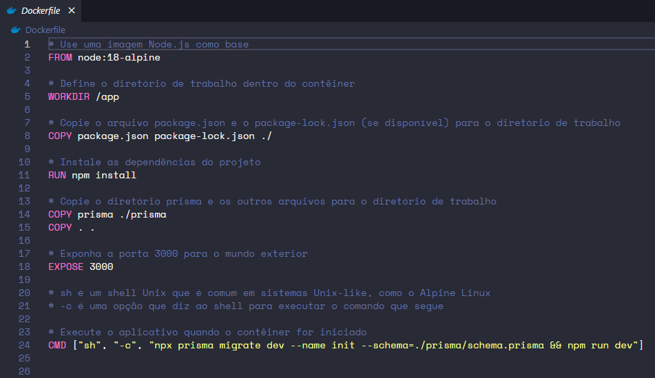
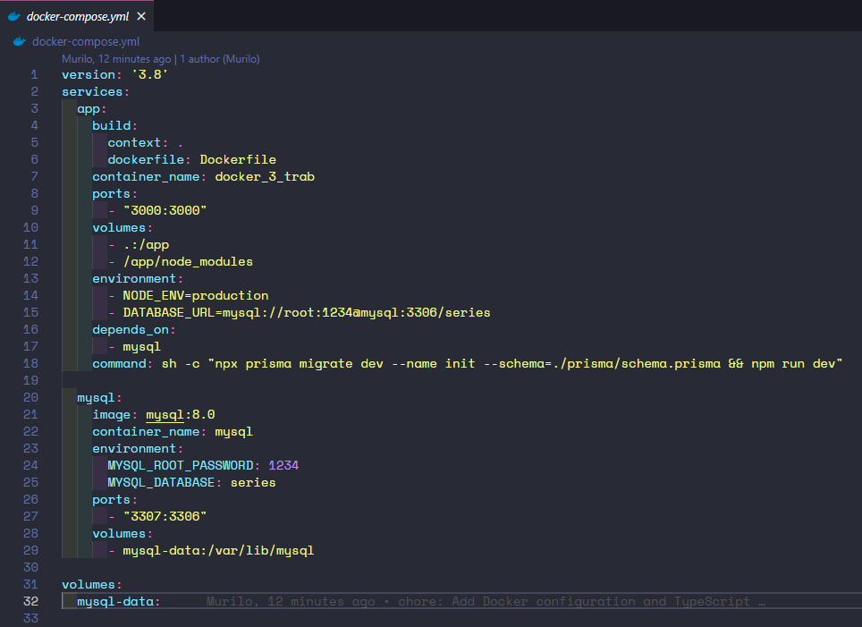

# Prints dos códigos Dockerfile e docker-compose;
## Código Dockerfile



## Código docker-compose



# Descrição da imagem mysql;
 Criamos uma imagem mysql para a database.

# Descrição da imagem app;
 Criamos uma imagem app para a aplicação da API.

# Forma de configuração e instalação;
 Parar e remover os containers em execução
````bash
docker-compose down
````
 Construir e executar novamente os containers
````bash
docker-compose up --build
````
